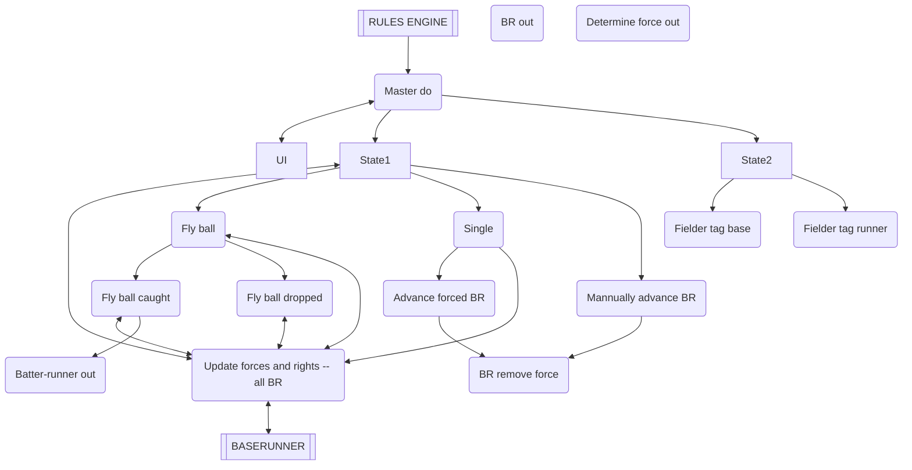

# RuEg v6 --> Jupyter | May 21, 2024 

```mermaid

flowchart
    RuEg[[RULES ENGINE]]
    MD(Master do)
    
    S1[State1]
    S2[State2]

    FB(Fly ball)
    Si(Single)

    BR[[BASERUNNER]]
    UFR(Update forces and rights -- all BR)

    FBC(Fly ball caught)
    FBD(Fly ball dropped)

    BRM(Mannually advance BR)
    BRF(Advance forced BR)
    BaRO(Batter-runner out)
    BRO(BR out)
    BRRF(BR remove force)

    FTB(Fielder tag base)
    FTR(Fielder tag runner)
    DFO(Determine force out)


    RuEg --> MD
    MD <--> UI

    MD --> S1
    MD --> S2

    S1 <--> UFR
    UFR <--> BR
    S1 --> FB
    S1 --> Si
    S1 --> BRM

    Si --> BRF
    Si --> UFR
    FB --> FBC
    FB --> FBD
    FB <--> UFR

    BRF --> BRRF
    BRM --> BRRF

    FBC <--> UFR
    FBC --> BaRO
    FBD <--> UFR

    S2 --> FTB
    S2 --> FTR

 
```

   FTB <--> DFO
    DFO --> BR
    DFO --> BRO
    DFO --> BaRO
