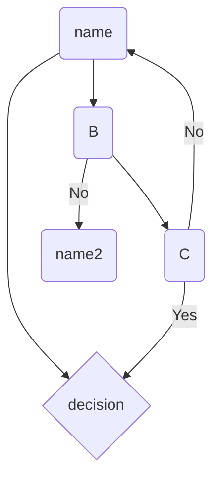

# Mermaid diagram

Let's go https://www.youtube.com/watch?v=JiQmpA474BY&t=749s


```mermaid
classDiagram
    class Order {
        Order Status
    }
    class Payment {
       Thing 2 

    }


```mermaid
sequenceDiagram
    participant Client
    participant Authprovider
    participant Server
    Client->>Authprovider: Request access token
    Authprovider->>Client: Send access token
    Client->>Server: Request resource
    Server->>Authprovider: Validate token
    Authprovider->>Server: Token valid
    
```
