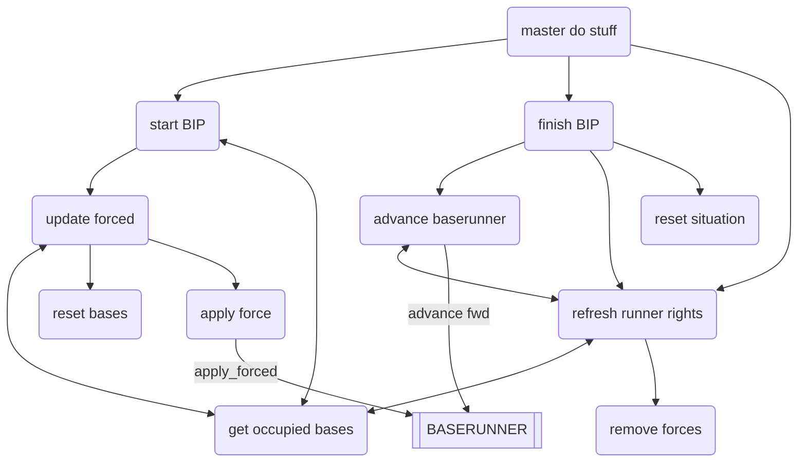

# Mermaid diagram

<!--  NOTE I HAD TO REMOVE TRIANGLE BRACKETS AS ARROWS BELOW
    M[[MAIN]] -- A
    M -- U1(update primary user input)
    A -- SP(screen print)
    SP -- BOT(get base occupants text)
    SP -- GRT(get runner rights text)
    SP -- PR[[SCREENPRINTER]]
    M -- U2(update secondary user input)
    M -- USS(update start-stop user input)
    
    U2 -- UR(update runners to act user input)
>