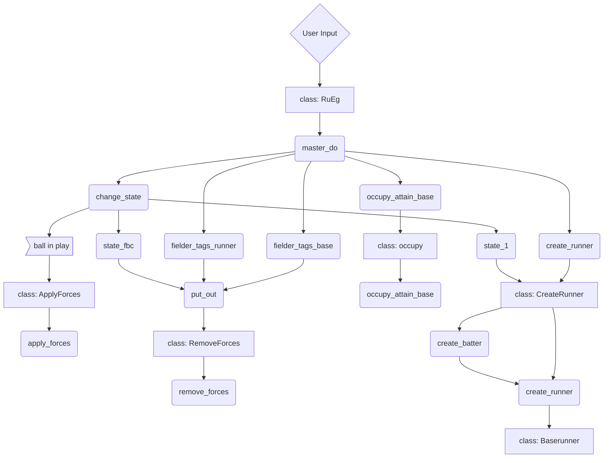

# Baseball rules engine VII

```mermaid
flowchart

    UI{User Input}

    %% ** composed classes ** 
    B[class: Baserunner]
    A[class: ApplyForces]
    af(apply_forces)
    R[class: RemoveForces]
    rf(remove_forces)
    C[class: CreateRunner]
    cb(create_batter)
    cr(create_runner)
    O[class: occupy]
    oab(occupy_attain_base)

    %% ** RuEg methods ** 
    RuEg[class: RuEg]
    MD(master_do)
    CS(change_state)
    S1(state_1)
    FBC(state_fbc)
    BIP>ball in play]
    FTR(fielder_tags_runner)
    FTB(fielder_tags_base)
    OAB(occupy_attain_base)
    PO(put_out)
    CR(create_runner)

    %% ** L1 ** 
    UI --> RuEg
    RuEg --> MD
    MD --> CS
    MD --> FTR
    MD --> FTB
    MD --> OAB
    MD --> CR

    %% ** L2: Change State **
    CS --> S1
    CS --> FBC

    %% ** BIP is a command within change_state() ** 
    CS --> BIP   
    BIP --> A 

    %% ** L3 **
    S1 --> C
    C --> cb
    cb --> cr
    A --> af
    FBC --> PO

    %% ** L2: Fielder actions **
    FTR --> PO
    FTB --> PO

    %% ** L3 ** 
    PO --> R
    R --> rf

    %% ** L2: Occupy-attain base **
    OAB --> O

    %% ** L3 **
    O --> oab

    CR --> C
    C --> cr
    
    cr --> B

```
